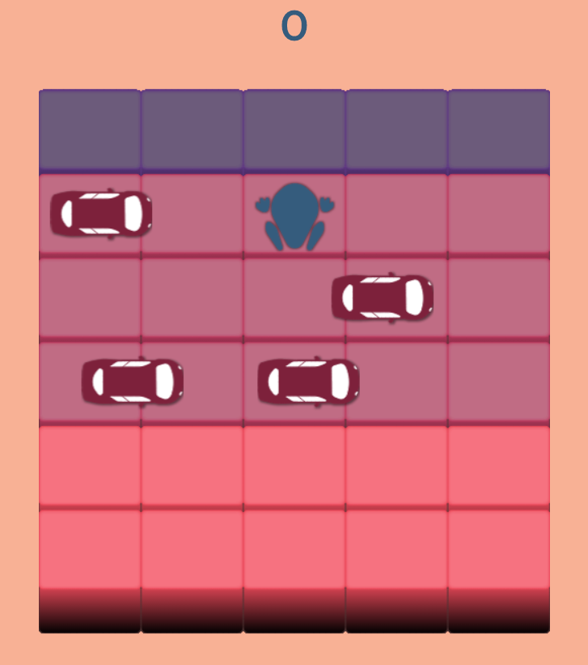

# A modern version of the classic Frogger game

This project aimed to implement HTML, CSS and JavaScript (the main front-end technologies) in an app which could be fun for users. Through this project, I focused on developing my object-oriented programming capabilities in a JavaScript context and on my ability to use the HTML5 Canvas.

#### To play, download the repository and open _index.html_ file in a web browser. The instructions are:
* Use the arrow keys on your keyboard to guide the frog to the top of the game platform.
* Each victory gives you 10 points.
* The game gets more difficult as your score increases.

